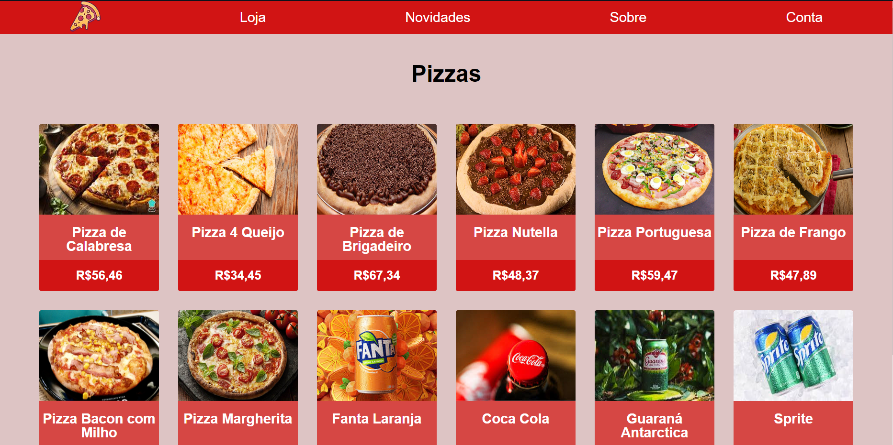

# PedePizza
Este é um projeto de um site de pizzas desenvolvido utilizando HTML, CSS, JavaScript e uma API REST feita em Node.js. O site foi projetado para ser responsivo e proporcionar uma experiência amigável aos usuários em diferentes dispositivos.



## Funcionalidades
- **Visualização de Pizzas:** Os usuários podem visualizar uma variedade de pizzas disponíveis no cardápio.
- **Adição ao Carrinho:** Possibilidade de adicionar pizzas ao carrinho de compras.
- **Realização de Pedidos:** Os usuários podem concluir pedidos e fornecer informações para a entrega.

## Tecnologias Utilizadas
- **Frontend:**
  - HTML
  - CSS
  - JavaScript

- **Backend/API:**
  - Node.js
  - Express (para criação da API REST)
  - JWT
  - MongoDB
  - Multer

## Instalação
1. **Clone o repositório:**
   ```bash
   git clone https://github.com/JoaoSantos2007/PedePizza.git
   ```

2. **Instale as dependências:**
   ```bash
   # Navegue até o diretório
   cd PedePizza/
     
   # Instale as dependências
   npm install
   ```

3. **Configuração da API:**
   - Certifique-se de configurar as variáveis de ambiente necessárias para a correta execução da API:
 
   - ```plaintext
     PORT=porta_da_aplicação
     MONGO_URL=url_do_mongodb
     DATABASE_NAME=nome_do_banco_de_dados
     SALT=sal_da_criptografia
     SECRET=segredo_do_jwt
     ```

4. **Executar o projeto:**
   ```bash
   npm start
   ```

## Contribuição
Contribuições são bem-vindas! Se você deseja contribuir para este projeto, siga as diretrizes de contribuição. Antes de enviar qualquer alteração, certifique-se de discutir as mudanças que deseja fazer.

## Licença
Este projeto está licenciado sob a [Licença MIT](LICENSE).

## Autor
João Pedro Tomaz dos Santos - [JoaoSantos2007](https://github.com/JoaoSantos2007)
